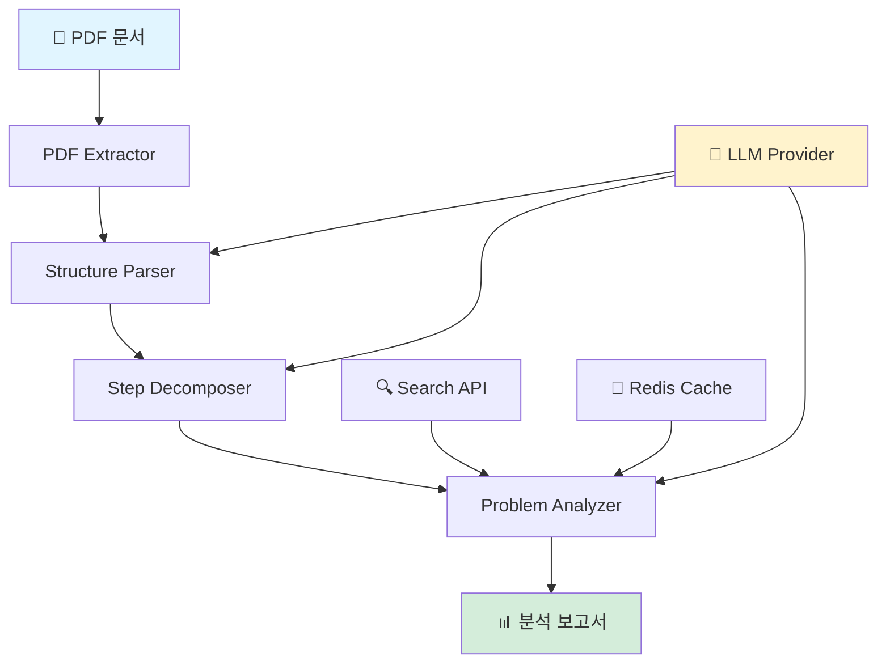

<div align="center">

# 🤖 NLP Pipeline Analyzer

**자연어처리 보고서를 분석하여 파이프라인과 문제 해결 과정을 자동으로 추출하는 AI 시스템**

[](https://www.python.org/downloads/)
[](LICENSE)
[](LLM_PROVIDERS.md)

[특징](#-주요-특징) •
[빠른 시작](#-빠른-시작) •
[사용법](#-사용법) •
[문서](#-문서) •
[예시](#-출력-예시)

</div>

---

## 📖 소개

NLP Pipeline Analyzer는 연구 보고서나 기술 문서에서 **데이터 처리 파이프라인을 자동으로 추출**하고, 각 단계가 **어떤 문제를 해결하는지 분석**하는 멀티 에이전트 시스템입니다.

### 🎯 핵심 기능

- **📄 PDF 자동 분석**: PyMuPDF로 구조화된 정보 추출
- **🔍 스마트 파싱**: LLM 기반 섹션 분류 (목적, 배경, 데이터, 파이프라인, 계획)
- **⚙️ 단계 분해**: 복잡한 파이프라인을 순차적 스텝으로 자동 변환
- **🧠 문제 식별**: 각 단계가 해결하는 기술적 문제 자동 분석
- **🔎 실시간 검색**: Tavily/DuckDuckGo API로 기법 관련 정보 검색
- **💾 스마트 캐싱**: Redis 기반 중복 작업 방지

### 💡 사용 사례

- 📚 연구 논문의 방법론 자동 요약
- 🎓 학술 보고서 구조 분석 및 시각화
- 🏢 기술 문서의 프로세스 자동 추출
- 🔬 실험 파이프라인 문서화 자동화

---

## 🏗️ 시스템 구조



| 컴포넌트 | 역할 | 기술 |
|---------|------|------|
| **PDF Extractor** | 텍스트 및 구조 정보 추출 | PyMuPDF, pdfplumber |
| **Structure Parser** | 문서를 5개 섹션으로 분류 | LLM Few-shot Learning |
| **Step Decomposer** | 파이프라인을 순차적 단계로 분해 | LLM Chain-of-Thought |
| **Problem Analyzer** | 각 단계의 해결 문제 식별 | LLM + Search API |

---

## 🚀 빠른 시작

### 필수 요구사항

- Python 3.8 이상
- (선택) Redis (캐싱 기능)

### 1️⃣ 설치

```bash
# 저장소 클론
git clone https://github.com/yourusername/nlp-pipeline-analyzer.git
cd nlp-pipeline-analyzer

# 의존성 설치
pip install -r requirements.txt
```

### 2️⃣ 환경 설정

**Option A: 무료 버전**

<details>
<summary><b>Google Gemini</b></summary>

```bash
# 1. API 키 발급
# https://makersuite.google.com/app/apikey

# 2. .env 파일 생성
cp .env.example .env

# 3. API 키 입력
echo "GOOGLE_API_KEY=your_key_here" >> .env

# 4. config/config.yaml 수정
# llm:
#   provider: "google"
#   model: "gemini-pro"
```

</details>

<details>
<summary><b>Ollama (완전 무료, 로컬)</b></summary>

```bash
# 1. Ollama 설치 (백그라운드 자동 실행)
# Windows: https://ollama.ai/download

# 2. 모델 다운로드
ollama pull mistral

# 3. 정상 작동 확인
ollama list

# 4. config/config.yaml 수정
# llm:
#   provider: "ollama"
#   model: "mistral"

# 중요: ollama serve 명령은 필요 없습니다!
# Ollama는 설치 후 자동으로 백그라운드에서 실행됩니다.
```

</details>

**Option B: 유료 버전**

<details>
<summary><b>OpenAI / Anthropic / Hugging Face</b></summary>

```bash
# .env 파일에 API 키 추가
OPENAI_API_KEY=sk-...
# 또는
ANTHROPIC_API_KEY=sk-ant-...
# 또는
HUGGINGFACE_API_KEY=hf_...
```

</details>

> 📘 **더 자세한 설정**: [LLM Provider 가이드](LLM_PROVIDERS.md)에서 모든 옵션 확인

### 3️⃣ 실행

```bash
python main_pipeline.py "your_report.pdf"
```

🎉 완료! `output/` 디렉토리에서 결과를 확인하세요.

---

## 📚 사용법

### 기본 실행

```bash
# PDF 파일 분석
python main_pipeline.py "중간보고서.pdf"

# 출력 디렉토리 지정
python main_pipeline.py "report.pdf" --output ./results
```

### 빠른 검증

```bash
# 시스템 동작 확인
python validate_system.py

# 간단한 테스트 실행
python quick_start.py
```

### 개별 컴포넌트 테스트

```bash
# PDF 추출만
python -m src.pdf_extractor your_file.pdf

# 구조 파싱만
python -m src.structure_parser

# 단계 분해만
python -m src.step_decomposer
```

---

## 📊 출력 예시

### 생성 파일

```
output/
├── doc_abc123_raw_document.json           # PDF 추출 원본
├── doc_abc123_structured_document.json    # 섹션 분류 결과
├── doc_abc123_sequential_steps.json       # 파이프라인 단계
├── doc_abc123_problem_mapping.json        # 문제 매핑
└── doc_abc123_report.md                   # 📋 최종 분석 보고서
```

### 보고서 샘플

```markdown
# 🔬 NLP Pipeline 분석 보고서

## 📈 요약
- 전체 단계: 8개
- 식별된 문제: 12개
- 주요 단계: 2개

### 문제 카테고리 분포
- 🔵 data_quality: 5개
- 🟢 model_performance: 4개
- 🟡 computational: 3개

---

## 🔄 STEP 1: 웹 크롤링을 통한 데이터 수집

**분류**: data_collection  
**입력**: 뉴스 사이트 URL 목록  
**출력**: 원시 HTML 파일  
**기술**: BeautifulSoup, Selenium

### 해결하는 문제

🟡 **PROB_001** [data_quality]  
대량의 비구조화된 웹 데이터를 효율적으로 수집하기 어려움  
*해결 기법: BeautifulSoup*
```

---

## ⚙️ 설정


### config.yaml 수정

<details>
<summary><b>LLM 설정</b></summary>

```yaml
llm:
  provider: "google"  # openai, anthropic, google, ollama, huggingface
  model: "gemini-pro"
  temperature: 0.3
  max_tokens: 4096
```

**Provider별 추천 모델**:
- `openai`: gpt-4-turbo-preview, gpt-3.5-turbo
- `anthropic`: claude-3-opus-20240229, claude-3-sonnet-20240229
- `google`: gemini-pro, gemini-1.5-pro
- `ollama`: llama2, mistral, mixtral
- `huggingface`: mistralai/Mistral-7B-Instruct-v0.2

</details>

<details>
<summary><b>검색 API 설정</b></summary>

```yaml
search:
  primary_api: "tavily"      # tavily 또는 duckduckgo
  fallback_api: "duckduckgo" # 실패 시 대체 API
  timeout: 10
  max_results: 3
```

</details>

<details>
<summary><b>섹션 헤더 커스터마이징</b></summary>

```yaml
headers:
  purpose:
    keywords: ["분석 목적", "연구 목적", "목표"]
  background:
    keywords: ["분석 배경", "연구 배경", "배경"]
  data:
    keywords: ["사용 데이터", "데이터셋", "데이터"]
  pipeline:
    keywords: ["파이프라인", "방법론", "프로세스"]
  plan:
    keywords: ["향후 계획", "개선 방향", "Future Work"]
```

</details>

### prompts.yaml 수정

<details>
<summary><b>LLM 프롬프트 커스터마이징</b></summary>

```yaml
step_extractor:
  system: |
    You are a pipeline analysis expert...
  
  prompt: |
    Extract sequential steps from this pipeline description...
    
problem_analyzer:
  system: |
    You are a technical problem analyst...
  
  prompt: |
    Analyze what problem this step solves...
```

`config/prompts.yaml`에서 모든 프롬프트를 수정할 수 있습니다.

</details>

---

## 📁 프로젝트 구조

```
nlp_project_2/
├── 📄 main_pipeline.py          # 메인 실행 파일
├── 📄 quick_start.py             # 빠른 테스트
├── 📄 validate_system.py         # 시스템 검증
├── 📄 requirements.txt           # 의존성
├── 📄 .env.example               # 환경 변수 템플릿
│
├── 📂 config/
│   ├── config.yaml               # 시스템 설정
│   └── prompts.yaml              # LLM 프롬프트
│
├── 📂 src/
│   ├── pdf_extractor.py          # PDF 추출
│   ├── structure_parser.py       # 구조 파싱
│   ├── step_decomposer.py        # 단계 분해
│   ├── problem_analyzer.py       # 문제 분석
│   ├── search_client.py          # 검색 API
│   ├── models.py                 # 데이터 모델
│   └── utils.py                  # 유틸리티
│
├── 📂 output/                    # 분석 결과 저장
└── 📚 docs/
    ├── README.md                 # 이 문서
    ├── LLM_PROVIDERS.md          # LLM 설정 가이드
    ├── INSTALLATION.md           # 설치 가이드
    └── PROJECT_STRUCTURE.md      # 프로젝트 구조
```

---

## 🔧 고급 기능

### 캐싱 전략

Redis를 사용하여 반복 작업을 방지합니다:

```python
# 기법-문제 매핑: 7일간 캐싱
# 문서 상태: 1시간 캐싱
# 검색 결과: 영구 캐싱
```

**캐시 키 구조**:
- `technique:{hash}:problems` - 기법별 문제
- `doc:{doc_id}:status` - 문서 상태
- `search:{query_hash}:results` - 검색 결과

### 에러 처리

| 상황 | 처리 방법 |
|------|----------|
| PDF 품질 낮음 | 경고 출력 후 계속 진행 |
| LLM API 실패 | 3회 재시도 (exponential backoff) |
| 검색 API 실패 | Primary → Fallback → LLM 추론 |
| Redis 연결 실패 | 캐싱 없이 계속 진행 |

### 성능 최적화

- ✅ **병렬 처리**: 각 단계의 문제 분석 동시 실행
- ✅ **캐싱**: 중복 검색 방지로 50% 속도 향상
- ✅ **토큰 제한**: 긴 섹션 자동 요약
- ✅ **배치 처리**: 여러 문서 순차 처리 지원

---

## 📖 문서

- 📘 [LLM Provider 설정 가이드](LLM_PROVIDERS.md) - 모든 LLM 옵션 상세 비교
- 📗 [설치 가이드](INSTALLATION.md) - 단계별 설치 방법
- 📙 [프로젝트 구조](PROJECT_STRUCTURE.md) - 코드 구조 설명
- 📕 [구현 요약](IMPLEMENTATION_SUMMARY.md) - 기술적 세부사항

---

